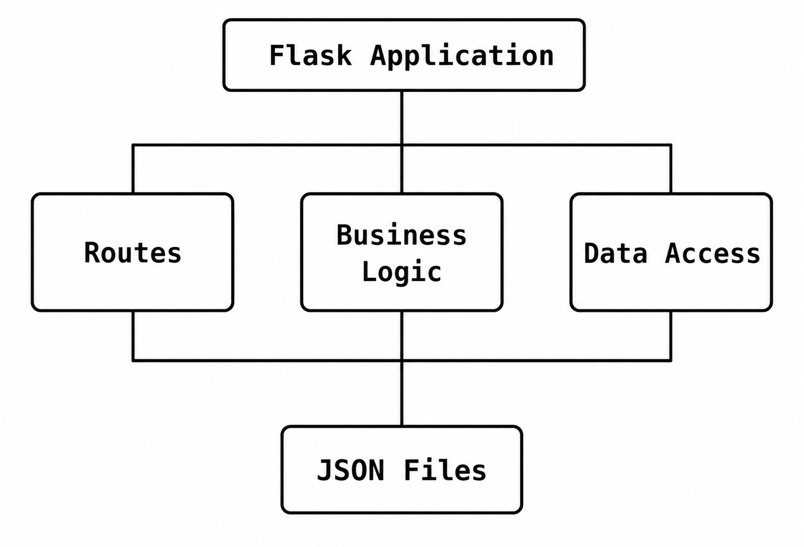
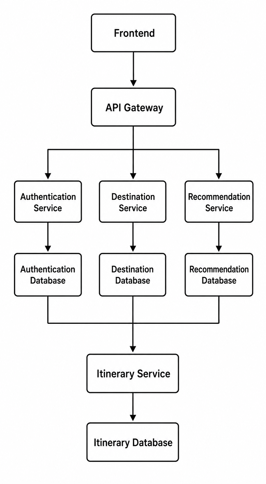

# GlobeTrotter - Architecture Documentation

> **Current Architecture Version:** v0.4 (Service Layer Refactoring)  
> **Previous Architecture:** Monolithic Flask Application  
> **Next Target:** Docker-based Microservices Architecture

---

# Overview

This document describes the evolution of GlobeTrotter's backend architecture, from the original monolithic Flask application provided for the project to the current layered architecture developed during the refactoring process.

The primary objective of the refactoring was to improve:

- Maintainability
- Readability
- Scalability
- Testability
- Separation of Concerns

while preserving the original business logic.

---

# Architecture Evolution

The project has evolved through three major architectural phases.

```
Original Monolith
        │
        ▼
Repository Pattern
        │
        ▼
Service Layer
        │
        ▼
Future Microservices
```

---

# Phase 1 — Original Monolithic Architecture

Initially, the application followed a simple Flask monolithic architecture.




Characteristics:

- Routes contained business logic.
- Routes accessed JSON files directly.
- Authentication logic was mixed with HTTP logic.
- Difficult to maintain as the project grows.
- Low code reusability.

---

# Limitations of the Monolith

Several limitations were identified.

## Tight Coupling

HTTP endpoints directly manipulated the data layer.

Example:

```
Route
   │
   ▼
read_json()
```

The route was responsible for:

- Validation
- Authentication
- Business logic
- Data access
- HTTP response formatting

Everything happened in one place.

---

## Code Duplication

Several modules repeated the same patterns:

- JSON reading
- JSON writing
- Authentication checks
- Response formatting

---

## Poor Maintainability

Adding a new feature often required modifications in multiple files.

Testing individual business logic independently was difficult.

---

# Phase 2 — Repository Layer

The first refactoring introduced the Repository Pattern.

Repositories became responsible for data access only.

```
Routes
    │
    ▼
Repositories
    │
    ▼
JSON Storage
```

Repositories no longer contain business logic.

Responsibilities include:

- Reading data
- Saving data
- Searching records
- Filtering records

---

# Base Repository

To eliminate duplicated code, a generic BaseRepository was introduced.

```
BaseRepository
      ▲
      │
 ┌────┼──────────────┐
 │    │              │
 │    │              │
 ▼    ▼              ▼
UserRepository
DestinationRepository
ItineraryRepository
```

The BaseRepository centralizes common operations.

Examples:

- get_all()
- save_all()
- append()

Every repository inherits these capabilities.

Benefits:

- Less duplicated code
- Better maintainability
- Easier testing

---

# Phase 3 — Service Layer

Business logic was removed from routes.

Routes now communicate with Services.

```
Client
   │
   ▼
Route
   │
   ▼
Service
   │
   ▼
Repository
   │
   ▼
JSON Storage
```

Responsibilities became clearly separated.

---

# Route Layer

Responsibilities:

- Receive HTTP requests
- Read request parameters
- Call the appropriate Service
- Return HTTP responses

Routes no longer:

- manipulate JSON files
- implement business rules

---

# Service Layer

Services contain all business logic.

Examples:

Authentication Service

- Register users
- Login users
- Validate credentials
- Generate JWT tokens

Destination Service

- Search destinations
- Filter destinations
- Validate search parameters

Recommendation Service

- Generate personalized recommendations
- Match user preferences
- Score destinations

Itinerary Service

- Create itineraries
- Retrieve user itineraries
- Validate itinerary data

---

# Repository Layer

Repositories manage persistence.

Examples:

UserRepository

Responsible for:

- finding users
- saving users

DestinationRepository

Responsible for:

- retrieving destinations

ItineraryRepository

Responsible for:

- retrieving itineraries
- storing itineraries

Repositories never contain business logic.

---

# Utility Layer

Several reusable utilities are shared across the project.

Current utilities include:

```
utils/

responses.py
jwt.py
password_utils.py
```

Responsibilities:

responses.py

- standardized API responses

jwt.py

- JWT generation
- JWT validation
- authenticated user extraction

password_utils.py

- password hashing
- password verification

Utilities are reusable by every service.

---

# Data Layer

Current persistence uses JSON files.

```
data/

users.json

destinations.json

itineraries.json
```

This storage mechanism is intentionally simple and suitable for the educational version of the project.

It will later be replaced by PostgreSQL.

---

# Current Request Flow

Authentication Example

```
HTTP Request

        │

        ▼

Authentication Route

        │

        ▼

Authentication Service

        │

        ▼

User Repository

        │

        ▼

Base Repository

        │

        ▼

users.json
```

The response follows the exact opposite path back to the client.

---

# Current Project Structure

```
app/

config.py

routes/

services/

repositories/

utils/

data/

tests/

docs/
```

Each folder has a unique responsibility.

This organization follows Clean Architecture principles.

---

# Design Principles

The architecture follows several software engineering principles.

## Separation of Concerns

Each layer has one responsibility.

---

## Single Responsibility Principle

Each class performs one specific task.

Examples:

UserRepository

Only manages user persistence.

AuthenticationService

Only manages authentication logic.

---

## Reusability

Utilities and repositories can be reused throughout the application.

---

## Scalability

New modules can be added without modifying existing layers.

---

## Testability

Business logic is isolated from HTTP requests.

Services can therefore be tested independently.

---

# Planned Architecture

The next milestone consists of migrating the monolithic backend to a Docker-based microservices architecture.

The target architecture is shown below.




Each microservice will:

- expose its own REST API
- own its own database
- be containerized with Docker
- communicate through HTTP APIs
- be independently deployable

---

# Future Technologies

The future architecture will include:

Backend

- Flask
- Docker
- Gunicorn

Infrastructure

- Docker Compose
- Kubernetes

Database

- PostgreSQL

API

- REST
- JWT

Frontend

- Next.js
- React
- TypeScript

Deployment

- Cloud Platform

---

# Conclusion

The GlobeTrotter backend has evolved from a simple educational monolithic application into a layered architecture following professional software engineering practices.

The introduction of the Repository Pattern, Base Repository and Service Layer significantly improves maintainability, readability and scalability.

This architecture now provides a strong foundation for the upcoming migration toward Docker-based microservices and cloud-native deployment.